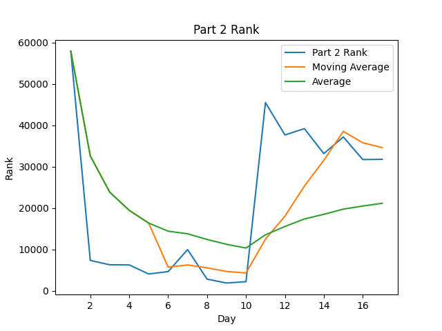
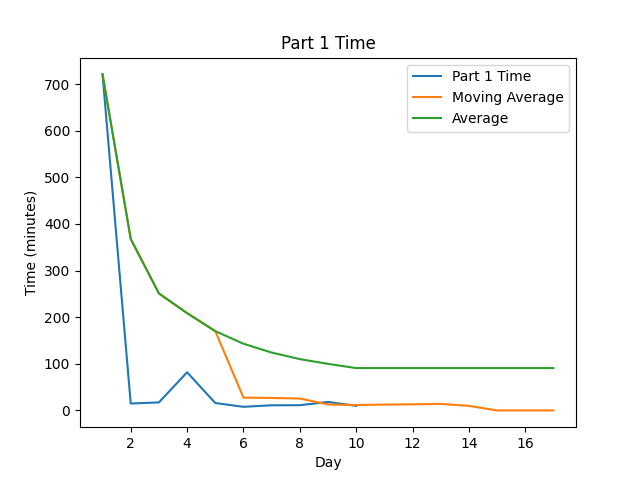

# AoC-2021

[Advent of Code](https://adventofcode.com) Solutions for 2021 in Rust.

## Highlights:

#### Favorite problems:

* 

#### Interesting approaches:

* [Day 6]: Gotta love a good memoization problem

#### Leaderboard appearances:

* 

## Stats
| Day | Part 1 Time (Rank) (Score) | Part 2 Time (Rank) (Score) |
|----:|----------------------------|----------------------------|
|   1 | 12:01:01 (67084) (  0)     | 12:04:18 (57892) (  0)     |
|   2 | 00:14:47 ( 8741) (  0)     | 00:17:26 ( 7381) (  0)     |
|   3 | 00:17:07 ( 6083) (  0)     | 00:57:45 ( 6324) (  0)     |
|   4 | 01:21:50 ( 7726) (  0)     | 01:24:40 ( 6294) (  0)     |
|   5 | 00:15:50 ( 1712) (  0)     | 00:49:02 ( 4106) (  0)     |
|   6 | 00:07:42 ( 1898) (  0)     | 00:38:18 ( 4676) (  0)     |
| Avg | 02:23:02 (15540) (  0)     | 02:41:54 (14445) (  0)     |

<!--suppress CheckImageSize -->
 
 

Note: Times are from time of challenge release, not start time to completion time

# Other Years' Solutions
[List of Advent of Code Repos](https://github.com/hbiede/hbiede/blob/main/aoc.md)

## Scripting initially based on a script from [Ullaakut](https://github.com/Ullaakut/aoc19). Expanded upon and fixed by [HBiede](https://github.com/hbiede)
#### Makefile Automation
* Automatically downloads the challenge and input for the day (e.g.: `make download DAY=03`)
  * In order to use this target, you need to specify your session cookie from adventofcode.com in cookies.txt through the usage of `make cookie SESSION={Insert your session cookie here}`.
  * Parses the challenge into a markdown file (adds Markdown style headers and code blocks).
* Setup the new day's source file from a template file while downloading the input and challenge per above (e.g.: `make DAY=03`)
* Create the stats table above by calling `make stats`
  * May require calling `pip3 install -r requirements.txt` to ensure you have all the necessary python dependencies
