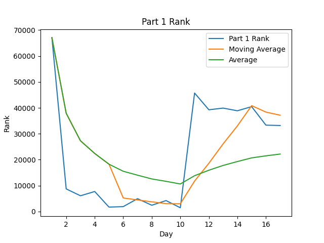
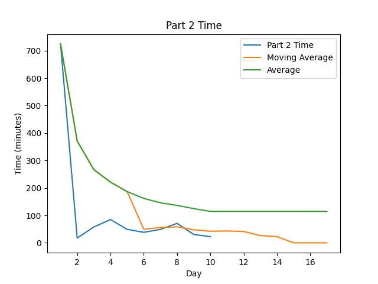

# AoC-2021

[Advent of Code](https://adventofcode.com) Solutions for 2021 in Rust.

## Highlights:

#### Favorite problems:

* [Day 8]: The second star of this day (7-segment decoding) was a bit tricky, but a unique problem I don't frequently face.
* [Day 12]: The modified DFS was pretty fun to think through.

#### Interesting approaches:

* [Day 6]: Gotta love a good memoization problem

#### Leaderboard appearances:

* 

## Stats
STATS_TABLE

Note: After spending a lot of time on day 16 and not finishing part 1, I took
[an open source solution](https://github.com/mikefarquhar/advent_of_code_2021/blob/main/16/src/main.rs) and modified it.

<!--suppress CheckImageSize -->
 
 

Note: Times are from time of challenge release, not start time to completion time

# Other Years' Solutions
[List of Advent of Code Repos](https://github.com/hbiede/hbiede/blob/main/aoc.md)

## Scripting initially based on a script from [Ullaakut](https://github.com/Ullaakut/aoc19). Expanded upon and fixed by [HBiede](https://github.com/hbiede)
#### Makefile Automation
* Automatically downloads the challenge and input for the day (e.g.: `make download DAY=03`)
  * In order to use this target, you need to specify your session cookie from adventofcode.com in cookies.txt through the usage of `make cookie SESSION={Insert your session cookie here}`.
  * Parses the challenge into a markdown file (adds Markdown style headers and code blocks).
* Setup the new day's source file from a template file while downloading the input and challenge per above (e.g.: `make DAY=03`)
* Create the stats table above by calling `make stats`
  * May require calling `pip3 install -r requirements.txt` to ensure you have all the necessary python dependencies
